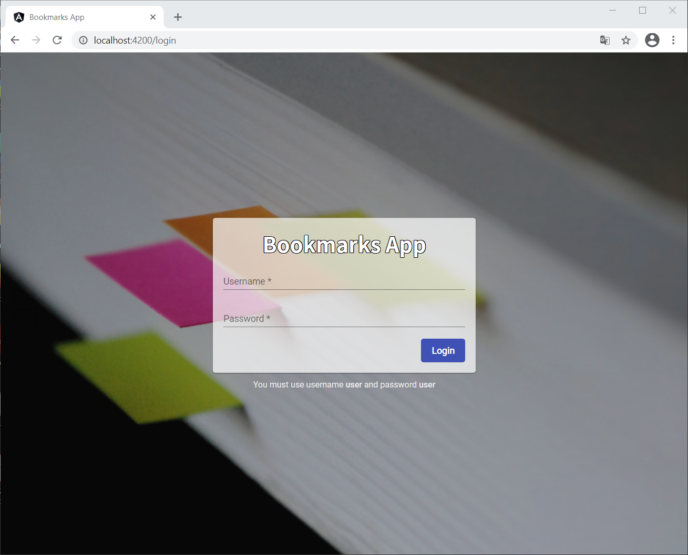
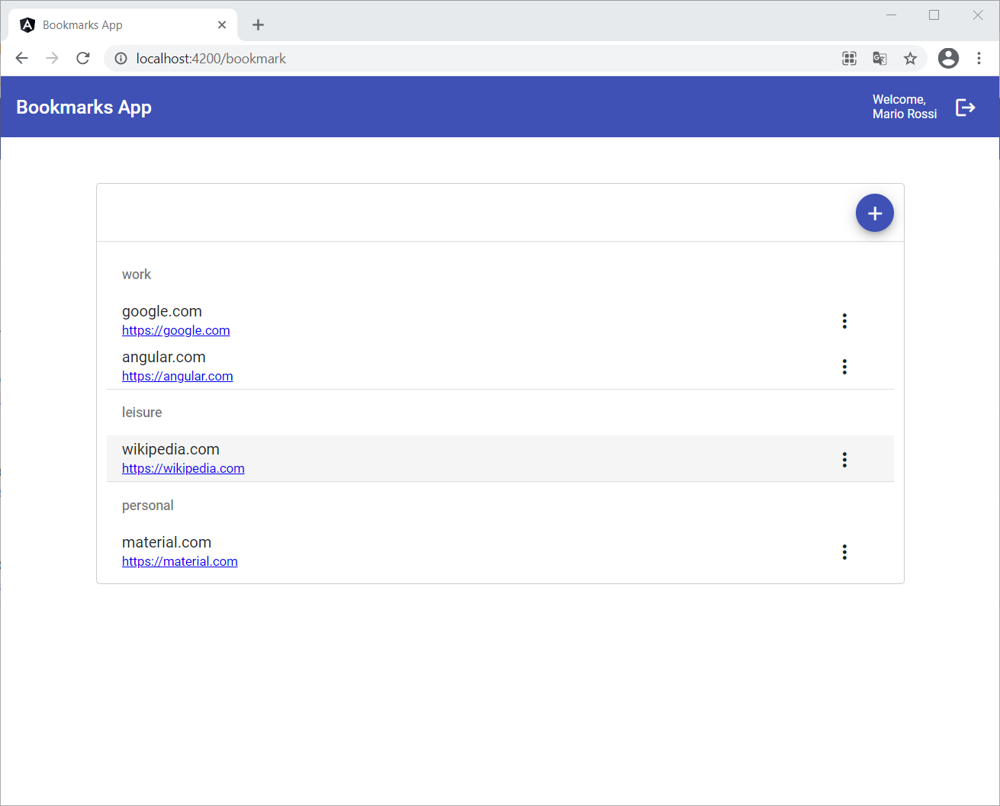
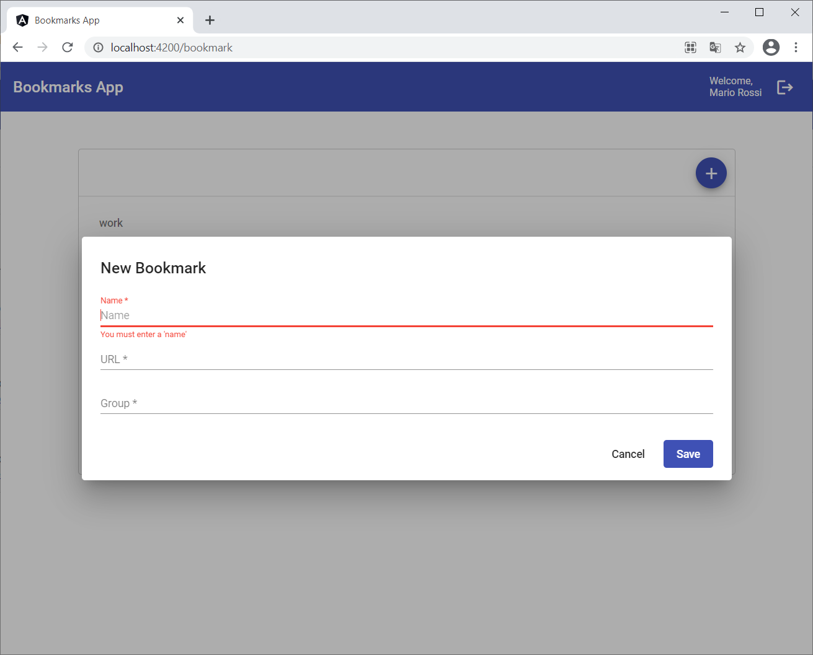
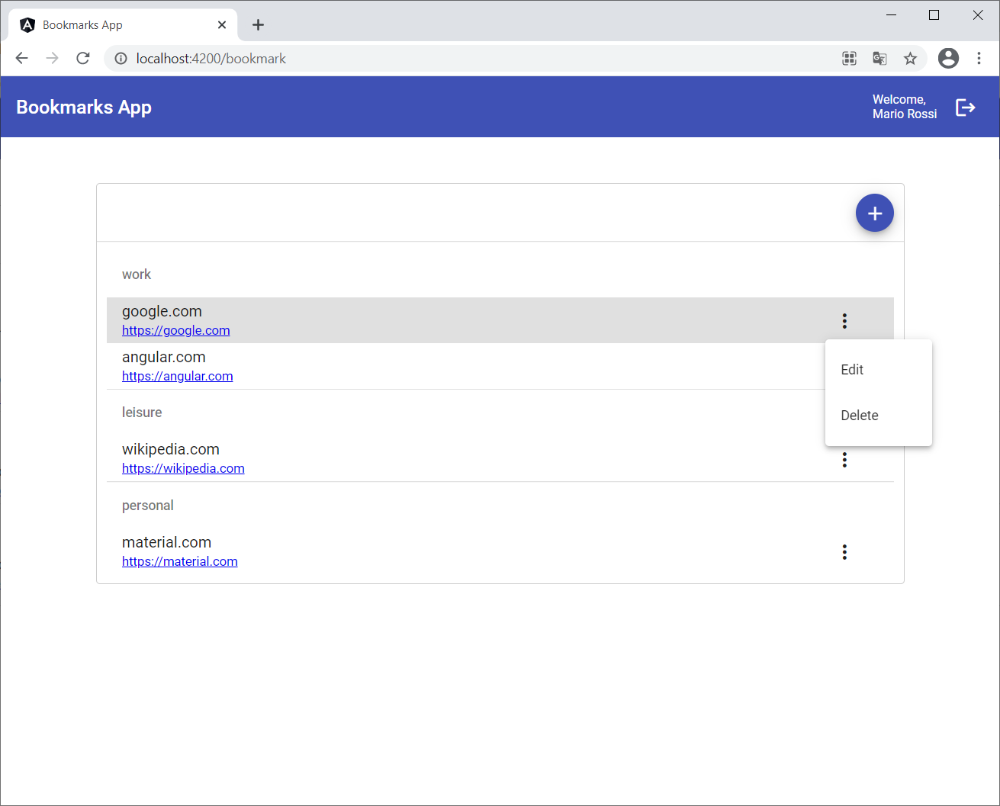
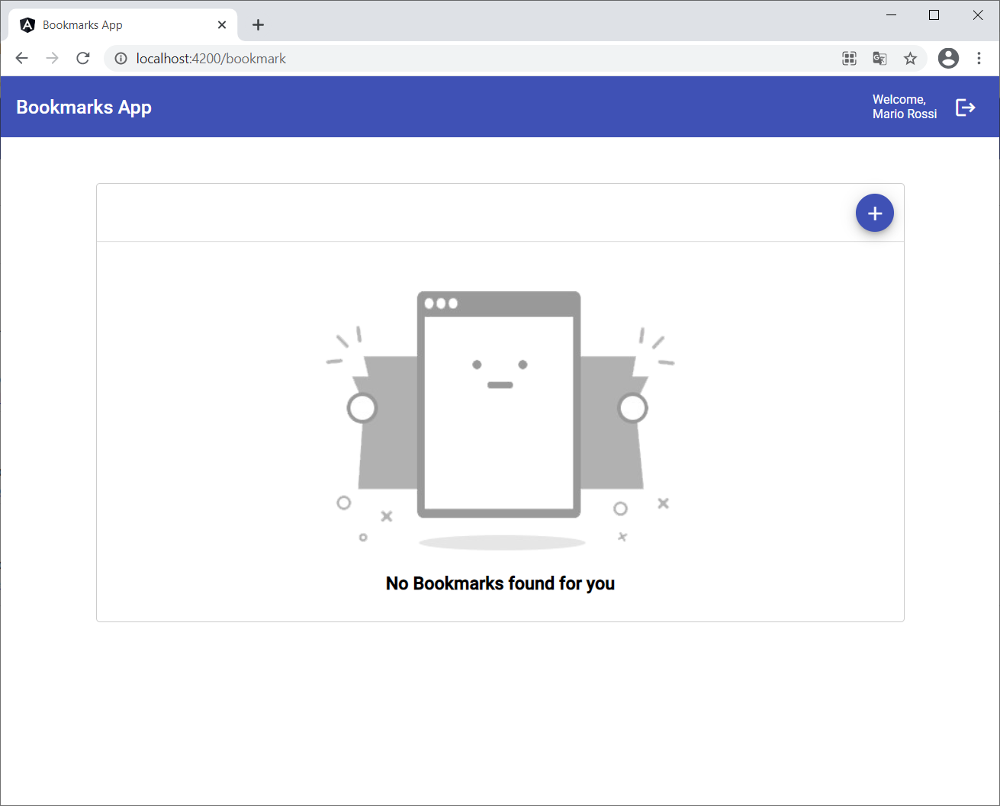

# Bookmarks App

## Solution
The solution adopted involves the use of a backend service implemented by the `json-server` module listening on port 3000.\
The service exposes CRUD functionality on the `bookmarks` resource and minimal `user` management like login.

The application is divided into the following modules:
1. `CoreModule`
   The CoreModule should contain singleton services (which is usually the case), universal components and other features where there’s only once instance per application.
2. `SharedModule`
   The SharedModule is where any shared components, pipes/filters and services should go.\
   For this app was used for manage libs modules, like angular material.
3. `modules/AuthModule`
   The AuthModule contains authentication features.
4. `modules/BookmarkModule`
   The BookmarkModule contains the features related to bookmark management.\
   For this module was used **ngrx** and **redux pattern**.

## Screenshots








## Instructions how to run the application
```bash
# clone the repo
git clone https://github.com/portus84/bookmarks-app.git


# change directory to repo
cd bookmarks-app

# Use npm or yarn to install the dependencies:
npm install

# start the server
npm run-script start:bundle-env
```

## Instructions for login app
For login on app use:
> username: `user`\
> password: `user`
